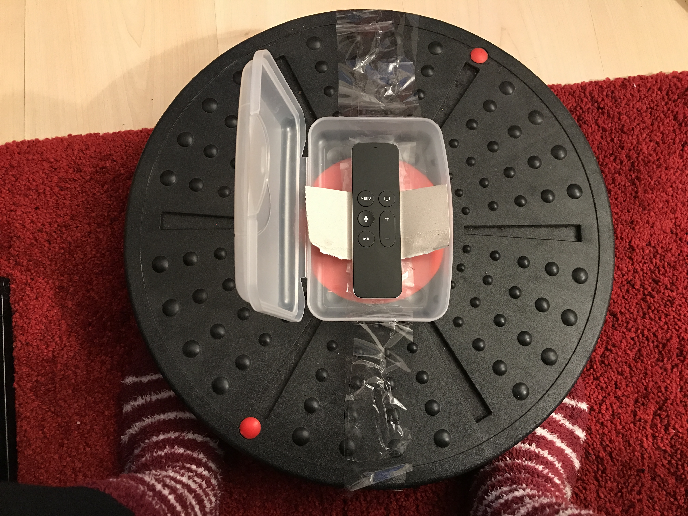
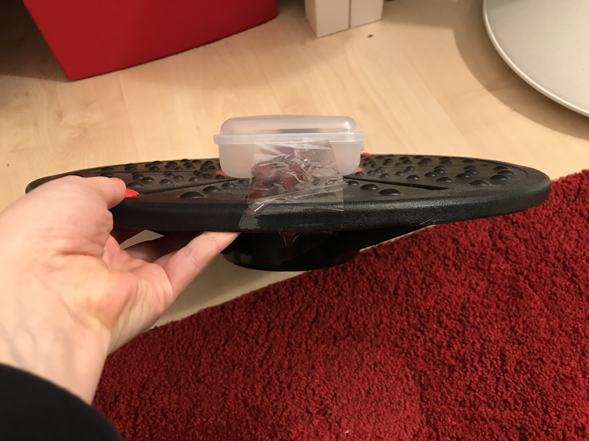
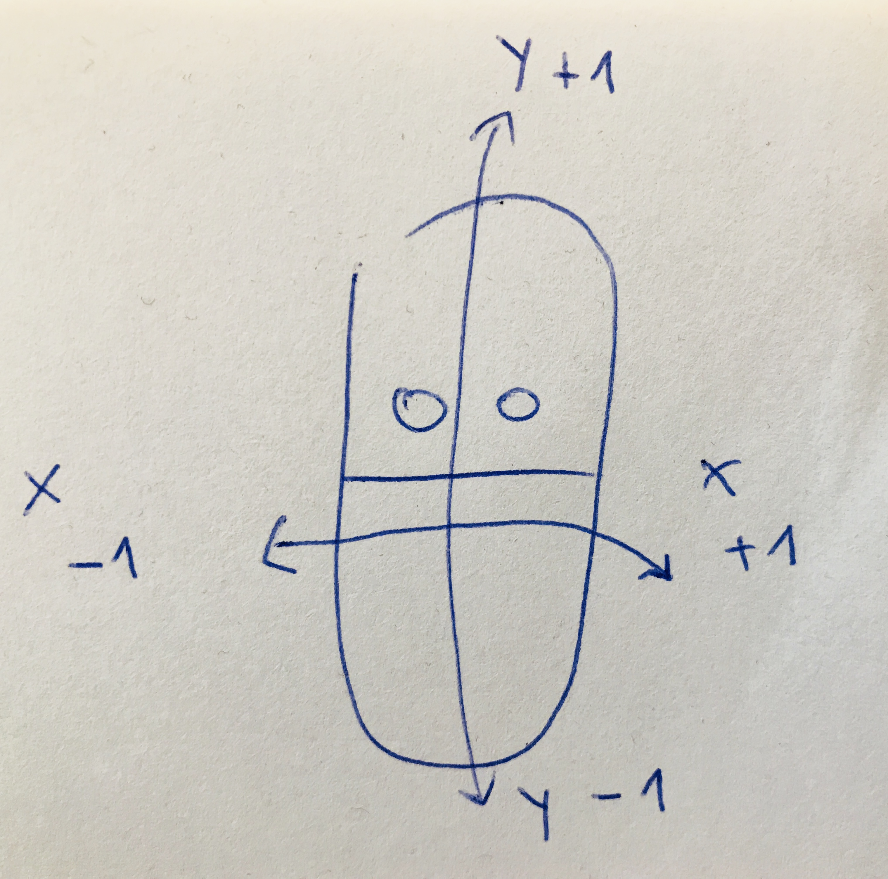

# Apple TV Balance Board
Create your own DIY balance board for Apple TV with Siri Remote. The Siri Remote has a built-in accelerometer and gyroscope. I'd love to get your feedback about my project and wrote a [blog post](https://dev.to/denisenepraunig/diy-apple-tv-balance-board--2m9o) about it on [The Practical Dev](https://dev.to/).

[](https://www.youtube.com/watch?v=5PygsgZDwFk)

[See the DIY Apple TV Balance Board in Action](https://www.youtube.com/watch?v=5PygsgZDwFk)

## Why?
Several years ago I broke my leg and I trained with a balance board to get fit again. It was a good training but very boring, because of this I always wanted to create my own balance board games. The Wii balance board was a great piece of hardware, but using it was not really challenging for my muscles. It is posible to create an own [DIY Wii like balance board](http://www.instructables.com/id/Make-your-own-Balance-Board-and-be-on-your-way-to/). It would have been very unlikely that I would be able to create a game for the Wii balance board and I heard game console dev kits are really expensive and hard to get. 

I am a Swift developer, I wanted to use a real "challenging" balance board and own an Apple TV. Siri Remote has a built-in accelerometer and gyroscope so this was the perfect solution for me. My goal was that everyone can build her own balance board with the balance board that is sufficient for you, your fitness level and your budget. I am currently working on an Apple TV games that support my DIY Apple TV Balance Board but would also be playable with only the Siri Remote. I will tweet about the progress as [@denisenepraunig](https://twitter.com/denisenepraunig).

In this repository I will provide some background information and a starter projects so that you can make your own balance board games. A big shout out and thank you to [Paul Hudson](https://twitter.com/twostraws) how made it really easy get started with Apple TV and SpriteKit development: [Hacking with tvOS](https://www.hackingwithswift.com/store/hacking-with-tvos) and [Dive into SpriteKit](https://www.hackingwithswift.com/store/dive-into-spritekit).

## Instructions
**I assume no liabiltiy when you accidentically step onto the plastic box, hurt yourself and break the Siri Remote!**

I put my Siri Remote inside a plastic lunch box so that I don't accidentally step on it. I put some paper and cardboard inside the lunch box so that the Siri Remote doesn't move around. It is easy to open and close this kind of lunch box.



I mounted the lunch box onto the balance board with some tape. Using a velcro tape would also have been possible. You could glue the velcro tape onto the balance board and the lunch box. 



## Starter Projects
Currently there is one simple game example which you can control via the balance board or you hold the Siri Remote in your hands (best experience when you turn it upside down). Have a look inside the [starter projects](starter-projects/README.md).


## Technical Details
### Siri Remote
The Siri Remote has a built in accelerometer and gyroscope (source: [Apple TV technical specifications](https://support.apple.com/kb/SP724?locale=en_US)). The Siri Remote is also a game controller which supports the micro control layout, you can read more about it in the [Game Controller Programming Guide](https://developer.apple.com/library/content/documentation/ServicesDiscovery/Conceptual/GameControllerPG/IncorporatingControllersintoYourDesign/IncorporatingControllersintoYourDesign.html#//apple_ref/doc/uid/TP40013276-CH4-SW6) and watch the [WWDC talk about Siri Remote and Game Controllers](https://developer.apple.com/videos/play/techtalks-apple-tv/4/).


### Accessing Siri Remote Sensor Values
The sensor values from the Siri Remote can be read via a change-handler or by directly reading the values. Before reading the values the Siri Remote has to be registered as a game controller. Please refer to the Big Nerd Ranch guide [tvOS Games, Part 1: Using the Game Controller Framework](https://www.bignerdranch.com/blog/tvos-games-part-1-using-the-game-controller-framework/) for details. 

One thing I noticed when debugging in the simulator is that the Siri Remote is registered as an extended game pad. Therefore I only test my apps on real hardware.

Here you see the gravity x and y value ranges for the Siri Remote:



#### Reading sensor values via Motion Handler
```swift
func registerMicroGamePadEvents(_ microGamePad: GCMicroGamepad) {

    let motionHandler: GCMotionValueChangedHandler = { (motion: GCMotion) -> () in

        print("acc:\(motion.userAcceleration)")
        print("grav:\(motion.gravity)")
        print("att:\(motion.attitude)")
        print("rot:\(motion.rotationRate)")
    }

    gamePad?.motion?.valueChangedHandler = motionHandler
}
 ```
 
 Have a look at the the [GCMotion documentation](https://developer.apple.com/documentation/gamecontroller/gcmotion).
 
 #### Reading sensor values directly
 ```swift
 if let motion = gamePad.motion {

  player.position.x += CGFloat(motion.gravity.x) * 50
  player.position.y += CGFloat(motion.gravity.y) * 50
}
```

Have a look at the [GCAcceleration documentation](https://developer.apple.com/documentation/gamecontroller/gcacceleration).

## Why ...?
Here I want to share my thoughts on different solutions for building an own balance board.

### Why Apple TV?
I own a Mac for a couple of years and I am very happy with it (currently MBP 15") and I also own an iPhone and an iPad. In October 2016 I started my Swift iOS developer journey and I really enjoyed it. I bought an Apple TV in 2017 mainly because I saw that my favorite Yoga app was available as an Apple TV app. I really enjoyed the other native apps like Udemy, Coursera and Netflix of course. End of 2017 I wrote my first SpriteKit game for iOS and in the beginning of 2018 I wrote my first app and game for Apple TV with SpriteKit. 

As I am into the Apple ecoystem Apple TV was the logical choice for me. Siri Remote works out of the box with its accelerometer, I don't need a dedicated "dev kit" to develop an app for Apple TV and I can play my game on a big screen. No need to hook up an controller to play my game - no setup needed - Siri Remote is always connected to the Apple TV.

### Why not Arduino/Raspberry Pi/...?
My inital idea was to create the balance board with the Arduino and using some sensors. The arduino was connected to my Mac via cable. Cables suck. Should I fidget around with Bluetooth? Or send the data via WiFi? The sensor values need to be translated to some "actions" - like keyboard clicks - and how should I develop my games? Web based? Python? Do I always have to connect my Macbook to the TV? Phew... I could maybe use my phone instead - it is wireless - but stepping on a expensive phone? I need to write an app, send the data via websocket to an HTML5 game, websockets - serverside - node - hosting this - phew... Raspberry Pi - hm - Linux, Python, connecting hardware, writing games in PyGame maybe?! I am not that proficient in those things. Sure, all things are solveable, but I wanted it to be more a "software project" than a hardware hacking thing and I wanted to use my existing skills.

### Why not Wii Remote?
My colleague Ralf reminded me about the [Wii Remote](https://twitter.com/_rac01/status/966765788840513538) (or Wiimote for short) - he did a project where he controlled an Apple TV game via the Wii Remote. Long time ago I hooked up the Wii Remote with my laptop (Windows at this time) - but I don't know how long I had to fidget around until the bluetooth drivers worked... I could not connect the Wii Remote to my Macbook... Even today the word bluetooth gives me cold sweat - I will never do a hobby project which involves bluetooth ever again!. There was a software called [GlovePIE](https://glovepie.en.softonic.com/) for Windows which was able to "convert" certain commands - like if the Wii Remote was tilted 30° then send a KEY_LEFT event ([see GlovePIE scripting](http://www.instructables.com/id/Wiimote-and-Glovepie/)). I hacked together a solution where I [played Doom with the Wii Remote](https://www.youtube.com/watch?v=Li3dXuHR-UM).

### Why not MFT Challenge Disc?
Back then I did not know that such a device existed - a balance board with games, but anyway, as I am a developer I wanted to make my own games and those [MFT balance boards](https://www.amazon.com/MFT-Challenge-Disc-Fitness-apparel/dp/B001V9KXCY/ref=sr_1_2?ie=UTF8&qid=1519146912&sr=8-2&keywords=mft+disc) are quite expensive. In Germany you can order a [version with bluetooth](https://www.amazon.de/MFT-Trainings-Therapieger%C3%A4t-Challenge-9005/dp/B01ENJARHE/ref=pd_sim_200_6?_encoding=UTF8&psc=1&refRID=XPPZQ1DP6JTNFASMPQ4Z) which has an app for iOS and Android'

## PS
PS: If you find a game on the Apple TV store which you can control only via tilting your Siri Remote left/right/up/down you could also control it via the balance board if you put the Siri Remote upside down.

## Link summary
* [Blog post on The Practical Dev](https://dev.to/denisenepraunig/diy-apple-tv-balance-board--2m9o)
* [DIY Apple TV Balance Board in Action](https://www.youtube.com/watch?v=5PygsgZDwFk)
* [DIY Wii like balance board](http://www.instructables.com/id/Make-your-own-Balance-Board-and-be-on-your-way-to/)
* [Paul Hudson](https://twitter.com/twostraws): [Hacking with tvOS](https://www.hackingwithswift.com/store/hacking-with-tvos) and [Dive into SpriteKit](https://www.hackingwithswift.com/store/dive-into-spritekit)
* [Apple TV technical specifications](https://support.apple.com/kb/SP724?locale=en_US)
* [Game Controller Programming Guide](https://developer.apple.com/library/content/documentation/ServicesDiscovery/Conceptual/GameControllerPG/IncorporatingControllersintoYourDesign/IncorporatingControllersintoYourDesign.html#//apple_ref/doc/uid/TP40013276-CH4-SW6)
* [WWDC talk about Siri Remote and Game Controllers](https://developer.apple.com/videos/play/techtalks-apple-tv/4/)
* [tvOS Games, Part 1: Using the Game Controller Framework](https://www.bignerdranch.com/blog/tvos-games-part-1-using-the-game-controller-framework/)
* [GCMotion documentation](https://developer.apple.com/documentation/gamecontroller/gcmotion)
* [GCAcceleration documentation](https://developer.apple.com/documentation/gamecontroller/gcacceleration)
* [GlovePIE](https://glovepie.en.softonic.com/), [GlovePIE scripting Wii Remote](http://www.instructables.com/id/Wiimote-and-Glovepie/)
* [Playing Doom with the Wii Remote](https://www.youtube.com/watch?v=Li3dXuHR-UM)
* [MFT Challange disc](https://www.amazon.com/MFT-Challenge-Disc-Fitness-apparel/dp/B001V9KXCY/ref=sr_1_2?ie=UTF8&qid=1519146912&sr=8-2&keywords=mft+disc)
