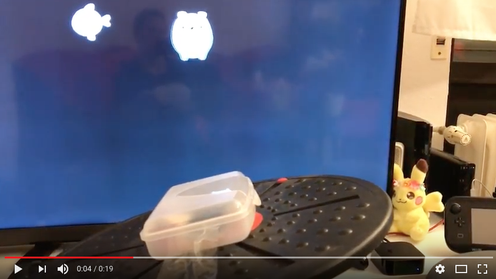

# Pictures

DIY Apple TV Balance Board in Action

[See the DIY Apple TV Balance Board in Action](https://www.youtube.com/watch?v=5PygsgZDwFk)

Reading sensor data from Siri Remote

Siri Remote inside lunch box

Lunch box mounted onto balance board with tape

