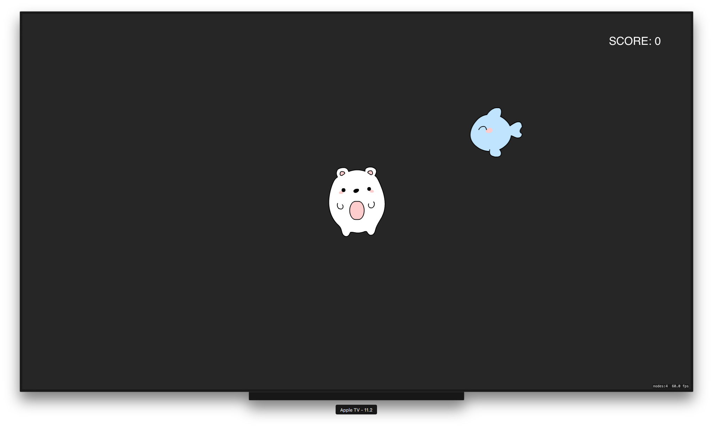

# Starter Projects

## BalanceBoardStarter1


In this little game example you control an ice bear and your aim is to catch the fish. You can control this game via the balance board or hold the Siri Remote in your hands. Currently there are no enemies implemented. After you catch a fish it will appear in a random position.

In the **AppDelegate.swift** you can find the registration of the Siri Remote as a game pad and you could also log the sensor values in:

```swift
func registerMicroGamePadEvents(_ microGamePad: GCMicroGamepad) {

    let motionHandler: GCMotionValueChangedHandler = { (motion: GCMotion) -> () in

        //print("acc:\(motion.userAcceleration)")
        //print("grav:\(motion.gravity)")
        //print("att:\(motion.attitude)")
        //print("rot:\(motion.rotationRate)")
    }

    gamePad?.motion?.valueChangedHandler = motionHandler
}
```
For details about this please refer to [tvOS Games, Part 1: Using the Game Controller Framework](https://www.bignerdranch.com/blog/tvos-games-part-1-using-the-game-controller-framework/).

Inside **GameScene.swift** the sensor values are directly accessed, e.g. ```motion.gravity.x```:

```swift
override func update(_ currentTime: TimeInterval) {

    // I stored the reference to the gamePad in the AppDelegate
    // which acts like a global variable

    // I did this because I could re-use the game pad in other scenes

    if let appDelegate = UIApplication.shared.delegate as? AppDelegate,
        let gamePad = appDelegate.gamePad,
        let motion = gamePad.motion {

        if lastUpdateTime > 0 {
            dt = currentTime - lastUpdateTime
        } else {
            dt = 0
        }
        lastUpdateTime = currentTime

        // you could also do just '* 50' if you do not care about the variable frame rate
        player.position.x += CGFloat(motion.gravity.x) * playerSpeed * CGFloat(dt)
        player.position.y += CGFloat(motion.gravity.y) * playerSpeed * CGFloat(dt)

        checkPlayerBoundaries()
    }
}
```
